# WaIIer47 Mechanical Keyboard
Custom design 47 key ortholinear keyboard with PCB, and Atmega32u4 Microcontroller

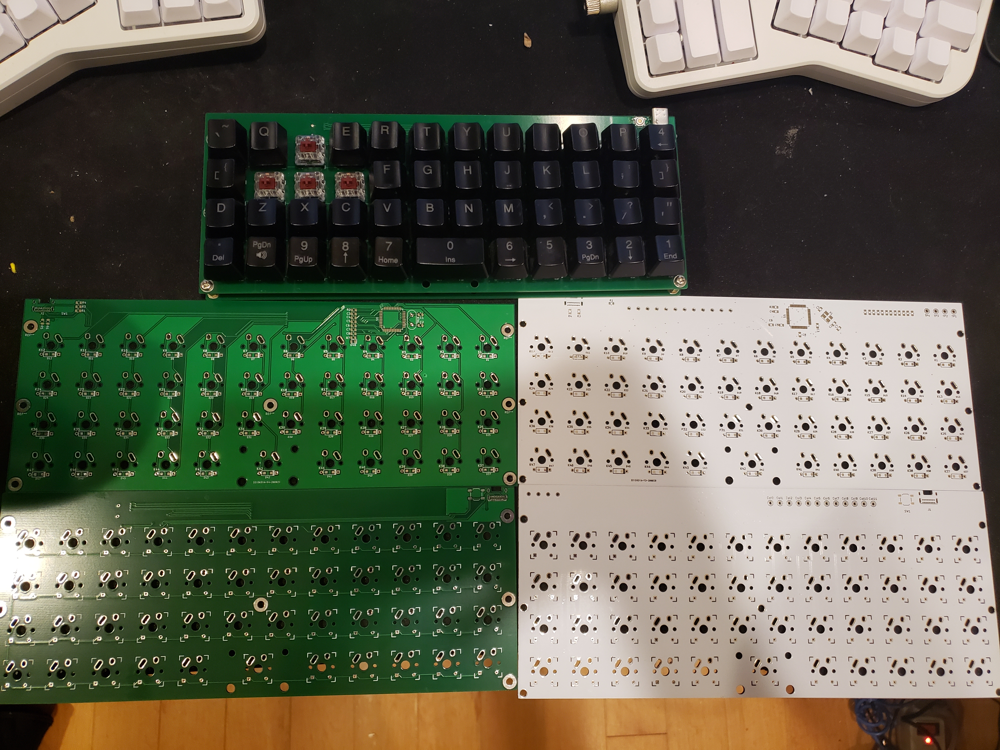
Revision 2 Green, Revision 1 White, Back top, Front bottom

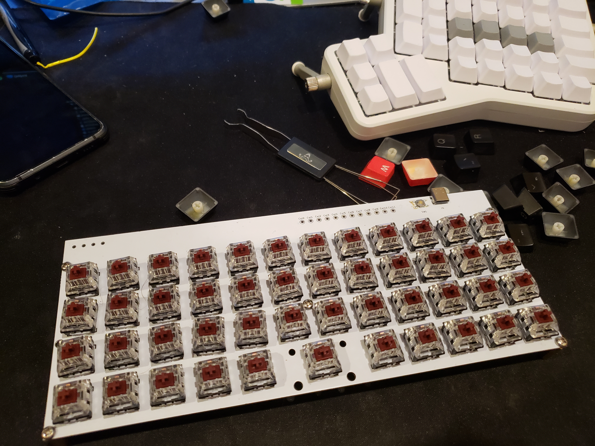
# PCB Tutorial
Designing a custom mechanical keyboard PCB using KiCad. The following was based on [Ruiqi Mao's Tutorial](https://github.com/ruiqimao/keyboard-pcb-guide)

## Download Kicad and Install the Mechanical Keyboard Libraries

* Download and install Kicad from https://kicad-pcb.org/
  * During installation, choose to download Kicad's default libraries
* Clone the following two repositories (or download zip and extract):
  * `keyboard_parts.pretty` from https://github.com/tmk/keyboard_parts.pretty
  * `keebs.pretty` from https://github.com/egladman/keebs.pretty
  * `Type-C.pretty` from https://github.com/ai03-2725/Type-C.pretty
  * `kicad_lib_tmk`.lib https://github.com/tmk/kicad_lib_tmk

  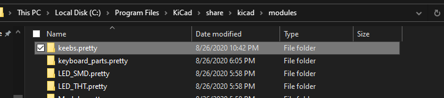

* Open `Kicad` > `Preferences` > `Manage Footprint Libraries`
  * In the `Global Libraries` tab, press the folder icon to `Add existing library to table`
  * Navigate to where you cloned the the libraries, click on the `keebs.pretty` and press `OK`
    * Do the same for `keyboard_parts.pretty` and `Type-C.pretty`
  * If done successfully, you should see the following in the `Global Libraries` tab:

  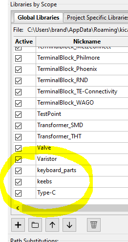
  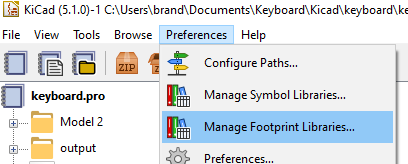

* Back in the Kicad Menu, `Preferences` > `Mange Symbol Libraries`
  * In the `Global Libraries` tab, press the folder icon to `Add existing library to table`
  * Navigate to where you cloned `kicad_lib_tmk` and select `keyboard_parts.lib`
  * Navigate to `Type-C.pretty` and select `Type-C.lib`
  * If done successfully, you should see the following:

  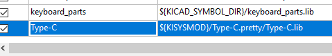

## Creating The Schematic File

* In Kicad: `file` > `New` > `New Project`
  * Create a new Folder for the project, and give a name for the project (I am using `tutorial_keyboard`)
  * Press `Save`
  * On the left side, you should now see 3 files:
    * `tutorial_keyboard.kicad_pcb`: The PCB file
    * `tutorial_keyboard.pro`: The project file, we will not be using this
    * `tutorial_keyboard.sch`: The schematic file

  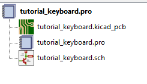

* Click on the `Schematic Layout Editor` button
* Because this schematic will be large, increase the paper size by going to `file` > `Page Settings...` then selecting the `C` page size

## Placing Components on the Schematic

* To place a part, press the `Place symbol` button on the right side
* For the microcontroller:
  * `Place symbol` and click on the page > expand `keybord_parts` > select `ATMEGA32U4` > press `OK` > Click on the sheet to place the component
  * You should now see the component placed on your page with the label U?
  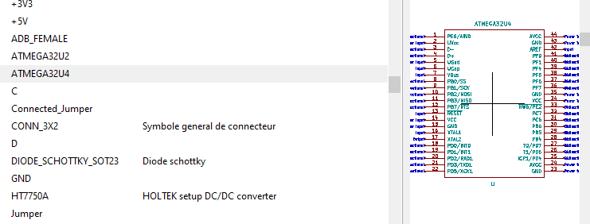
  
* Place the following components as required by the [datasheet](http://ww1.microchip.com/downloads/en/devicedoc/atmel-7766-8-bit-avr-atmega16u4-32u4_datasheet.pdf)
  * A 10 k$\Omega$ resustor near `HWB/PE2`
    * `Place symbol` > `keyboard_parts` > `R` > `Ok`
      * Press `r` before placing the component, or while hovering over the component after placing to rotate it
      * Hover over it and press `e` to `Edit Value Field`
      * Change the `Text` field to say `10k`
    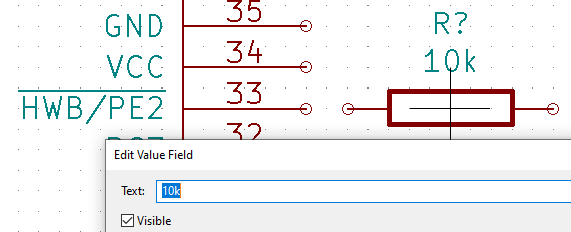
  * A 1 $\mu$F capacitor on `UCap`
    * `place symbol` > `keyboard_parts` > `C` > `Ok`
    * Change the its value to `1uF`
    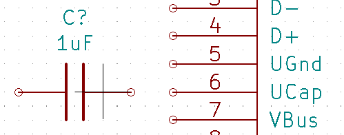
    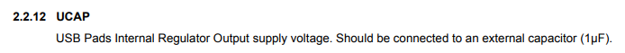
* Connect `Vcc` and `GND`
  * On the right side, slect `Place power port` > click on the page
  * Expand the `power` library and select > `VCC` > `Ok`
  * Place the VCC flag near `AVCC`
    * On the right, click the `Place wire` icon
    * Click at the empty circle on `AVCC` and make a connection to the `VCC` flag
    
    * Repeat for:
      | Pin | Name   |
      |-----|--------|
      | 2   | `UVcc` |
      | 7   | `VBus` |
      | 14  | `VCC`  |
      | 24  | `AVcc` |
      | 34  | `VCC`  |
      | 44  | `AVcc` |
    * Make sure there are 6 total connections to `VCC`
    * Individual connections to `VCC` in the schematic do not need to be connected together
    * Connect `VCC` to a power flag
      * `Place symbol` > Search for `PWR_FLAG` > `PWR_FLAG`
      * Connect the `PWR_FLAG` to `VCC`
      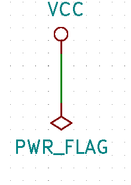
  * `Place power port` > `GND` (`Power flag, ground` from the `s`power` library)
    * Create a connection to `GND` on the following pins:
      | Pin | Name   |
      | --- | ------ |
      | 5   | `UGND` |
      | 15  | `GND`  |
      | 23  | `GND`  |
      | 35  | `GND`  |
      | 43  | `GND`  |
    * Additionally, connect the other end of the capacitor and resistor to `GND`
    * Make sure there are 5 connections to `GND`
    

* If there are any overlapping components or labels, press `m` over the component/label to move it somewhere else
  * You will have to remake any connections
* Reset Circuit
  * The following allows for a manual reset button that (If you do not want a reset button, connect `RESET` to `VCC`)
  * Move to an open part of the page
  * `Place symbol` > `keyboard_parts` > `SW_PUSH`
  * We want the voltage supplied to the reset pin to be `High (5V)` normally, and ground when pushed to reset the microcontroller
  * Connect the left side to `GND`
  * Create a connection between `VCC` -> 10 k$\Omega$ resistor -> switch-s right pin
  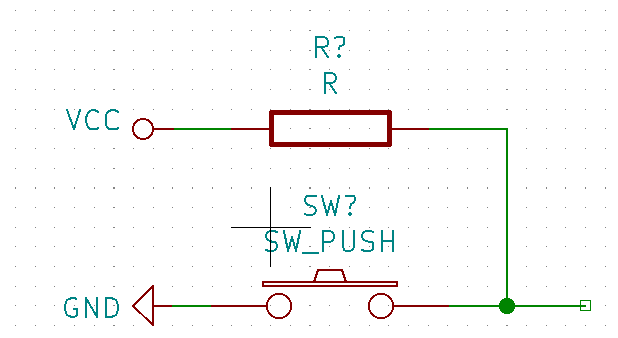
  * Place a flag on the right side:
    * In the right menu: `Place net label`
    * Give it the name `Reset`
    * Connect it to the wire on the right side
    * Place a net label with the name `Reset` on the `RESET` pin (pin 13) of the microcontroller
    * The reset circuit is now connected to the microcontroller
    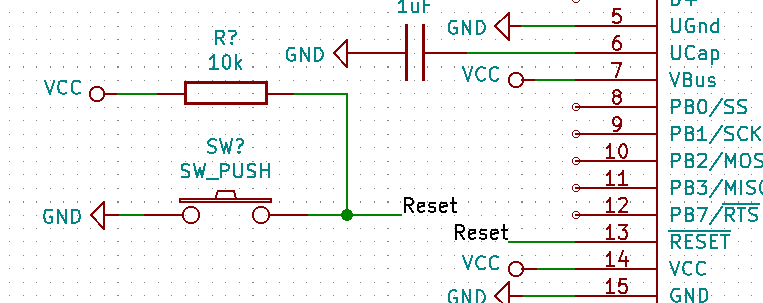
* USB Type-C Circuit
  * This keyboard will connect to a computer using a USB-C connector in USB 2.0 Mode
  * `Place symbol` > `Connector` > `USB_C_Receptacle_USB2.0`
  * Make the following connections

  | Receptacle Port | Connection |
  | --------------- | ---------- |
  | `VBUS` | `VCC` |
  | `CC1` | 5.1 k$\Omega$ resistor -> `GND` |
  | `CC2` | 5.1 k$\Omega$ resistor -> `GND` |
  | `D-` | Connect both `D-` pins through a 22 $\Omega$  resistor to a net called `D-` |
  | `D+` | Connect both `D+` pins through a 22 $\Omega$ resistor to a net called `D+` |
  | `SBU1` | Leave unconnected |
  | `SBU2` | Leave unconnected |
  | `GND` | `GND` |
  | `SHIELD` | `GND` |
  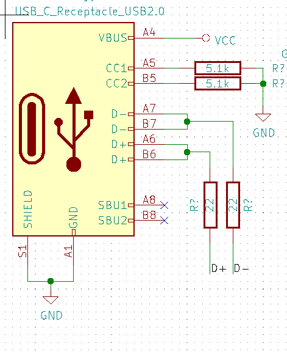
  * On the microcontroller, connect `D-` (pin 3) to the `D-` net and `D+` (pin 4) to the `D+` net
  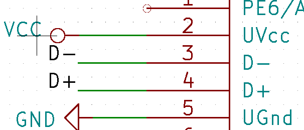

* Crystal Oscillator Circuit
  * The following circuit is required for the microcontroller to function as a USB device
  * `Place symbol` > `keyboard_parts` > `XTAL`
  * Connect a 22 pF capacitor to both ends of the `XTAL` with the other side going off to `GND`
  * Connect one side of the `XTAL` to a net called `xtal1` and the other to a net called `xtal2`
  * Connect the `xtal1` net to `XTAL1` (pin 16) and `xtal2` to `XTAL2` (pin 17) on the microcontroller
  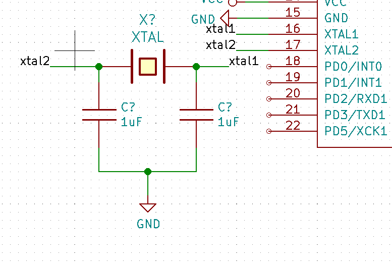

* Placing the keys
  * The following circuit is used for all the keys:
  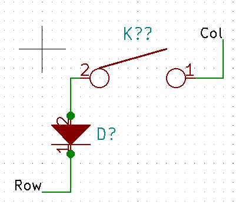
  * `Place symbol` > `keyboard_parts` > `KEYSW`
  * `Place symbol` > `keyboard_parts` > `D`
  * Connect the `2 pin` on the `KEYSW` on to the 2 pin on the diode **Orientation on the diode is extremely important**
  * For an 47 key ortholinear keyboard, copy and paste this circuit 46 times in rows of 12 (besides the third row which should have 11 keys)
  * Connect all the pin 1's on the switch on the same row
  * Connect all the pin 1's on the diode to the next pin 2 on the switch in the columns
  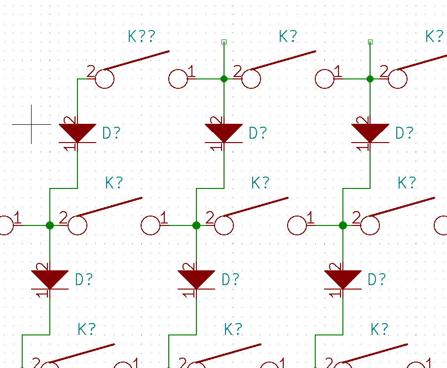
  * Connect the bottom row diodes together
  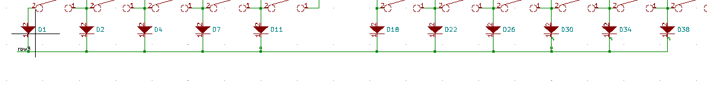
  * Create a net on the each of the vertical wire segments in the top row named `col0` to `col11`
  * Create a net on the the left most switch of each row labeled `row0` to `row3`
  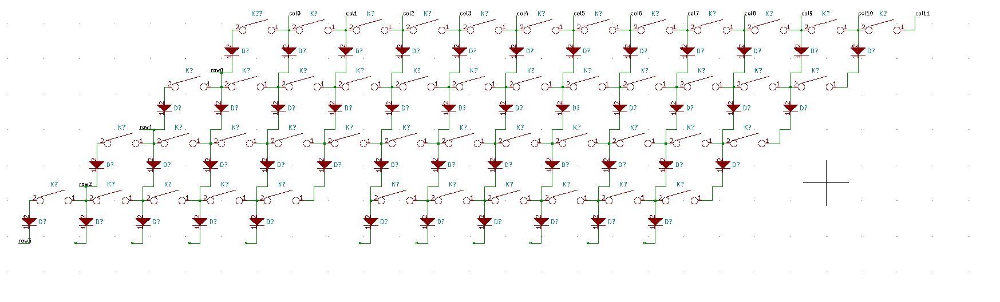
  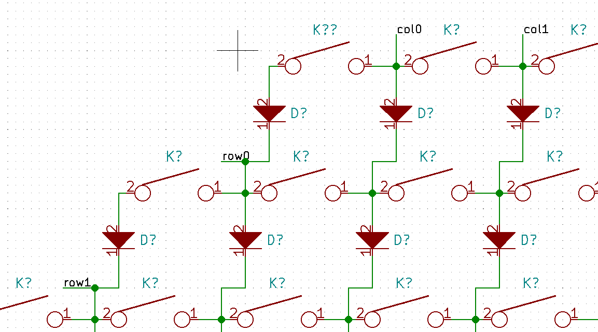
  * Connect each of the row and col nets to a GPIO pin on the microcontroller (`PAX`, `PBX`, `PCX`, or `PDX`) these can be changed later to make it easier to route the PCB
  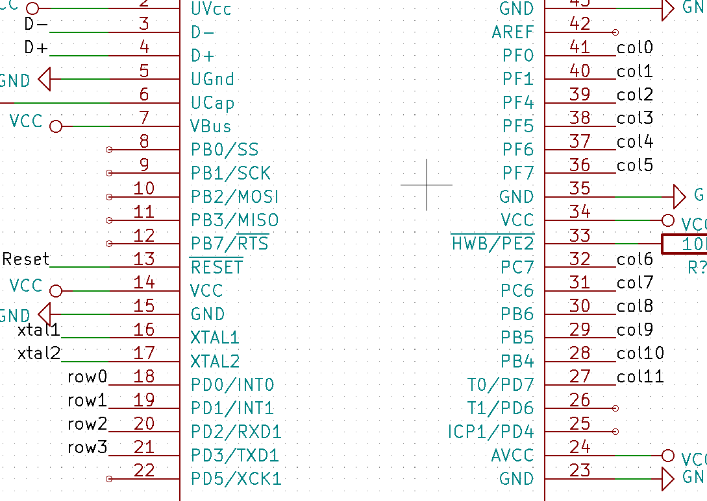
* Bypass Capacitors
  * Bypass capacitors are placed between all `VCC` nets and `GND`, watch this [video to learn more](https://www.youtube.com/watch?v=BcJ6UdDx1vg)
  * There are 6 connections that will use bypass capacitors
  * Create the following circuit using 0.1 $\mu$ capacitors
  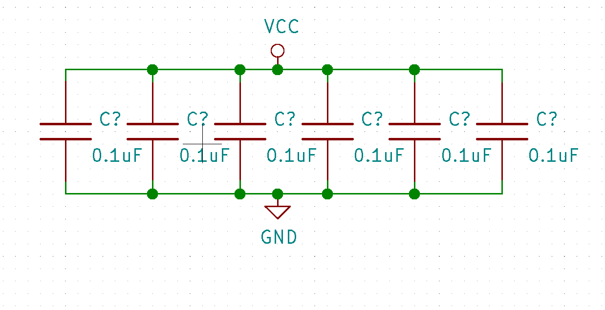
* Mark all unconnected ports
  * In the right menu, click `Place no connection flag`
  * Place the symbol over all unused ports on the microcontroller and on `SBU1` and `SBU2` on the USB C receptacle
  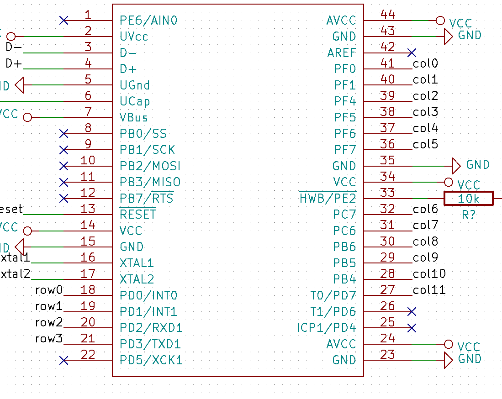
* Annotate the schematic to give components names
  * `Tools` > `Annotate Schematic`
  * Keep all default settings
  * Press `Annotate`
  * `Close`
* Run a Design Rules Check to make sure there are no errors in the circuit
  * `Perform electrical rules check` > `Run`
  * Fix any errors that occur, if there are only errors for your `VCC` or `GND` not being driven, you can move on
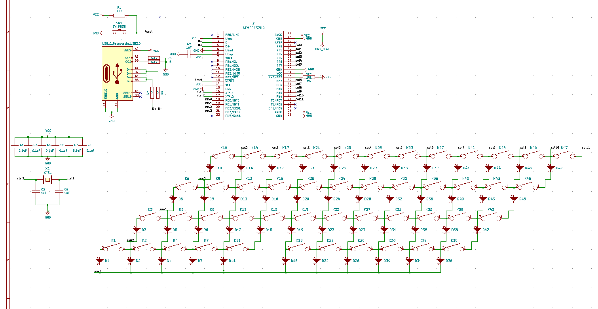

## Assigning Footprints

* Assigning footprints tell the PCB software what size to make all of your components. Additionally you will buy components based off the size of their footprint. For most components we will use the `0805` surface mount package. If you do not feel comfortable surface mounting components, you will have to heavily modify the PCB layout.
* `Tools` > `Assign Footprints...`
  | Components | Library | Footprint |
  | ---------- | ------- | --------- |
  | All Capacitors | `Capacitor_SMD` | `Capacitor_SMD:C_0805_2012Metric` |
  | All Diodes | `Diode_SMD` | `Diode_SMD:D_0805_2012Metric` |
  | USB C Receptacle | `Type-C` | `Type-C:USB_C_GCT_USB4085` |
  | All `KEYSW` **EXCEPT FOR THE SPACE BAR** | `keebs` | `keebs:Mx_Alps_100` |
  | Space Bar (sixth key in on the bottom row) | `keebs` | `keebs:Mx_Alps_200` |
  | All Resistors | `Resistor_SMD` | `Resistor_SMD:R_0805_2012Metric` |
  | `SW_PUSH` | `Button_Switch_SMD` | `Button_Switch_SMD:SW_SPST_TL3342` |
  | `ATMEGA32U4` | `Package_QFP` | `Package_QFP:TQFP-44_10x10mm_P0.8mm` |
  | `XTAL` | `keyboard_parts` | `keyboard_parts:XTAL_HC_49_TH`
    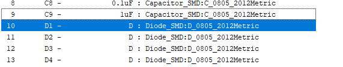
    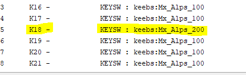
    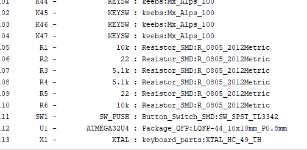
  * Press `OK`

## Creating the PCB

### Importing From the Schematic

* Close the schematic and open `PCB Layout Editor`
* `Tools` > `Update PCB from Schematic`
* Click Anywhere to Place all the components
* Click `Layers Manager` > `Items` > Uncheck the box next to `Ratsnest`
  * This will be helpful when routing the PCB, but it is not now

### Organizing your components

* Arrange the keys in the same order as your circuit

**WIP**
